# Module 3 - Comparative Genomics

## Table of contents
1. [Introduction & Aims](#introduction)
1. [Artemis Comparison Tool (ACT)](#act)
1. [Exercise 1](#exercise1)
1. [Exercise 2](#exercise2)
1. [Exercise 3](#exercise3)

**Instructors**: [Adam Reid](mailto:ar11@sanger.ac.uk) & [Stephen Doyle](mailto:sd21@sanger.ac.uk), Wellcome Sanger Institute

## Introduction & Aims 
The Artemis Comparison Tool (ACT), also written by Kim Rutherford, was designed to extract the additional information that can only be gained by comparing the growing number of sequences from closely related organisms (Carver et al. 2005). ACT is based on Artemis, so you will already be familiar with many of its core functions. It is is essentially composed of three layers or windows. The top and bottom layers are mini Artemis windows (with their inherited functionality), showing the linear representations of the DNA sequences with their associated features. The middle window shows red and blue blocks, which span this middle layer and link conserved regions within the two sequences, in the forward and reverse orientation respectively. Consequently, if you were comparing two identical sequences in the same orientation you would see a solid red block extending over the length of the two sequences in this middle layer. If one of the sequences was reversed, and therefore present in the opposite orientation, there would be a blue ‘hour glass’ shape linking the two sequences. Unique regions in either of the sequences, such as insertions or deletions, would show up as breaks (white spaces) between the solid red or blue blocks.

In order to use ACT to investigate your own sequences of interest you will have to generate your own pairwise comparison files. Data used to draw the red or blue blocks that link conserved regions is generated by running pairwise BLASTN or TBLASTX comparisons of the sequences. ACT is written so that it will read the output of several different comparison file formats; these are outlined in Appendix III. Two of the formats can be generated using BLAST software freely downloadable from the NCBI, which can be loaded and run on a PC or Mac. Another way of generating comparison files for ACT is to use the WebACT web resource (http://www.webact.org/). This site allows you to cut and paste or upload your own sequences, and generate ACT readable BLASTN or TBLASTX comparison files.

The aim of this Module is to:
- explore the basic functionality fo ACT using *Salmonella Typhi* and *Escherichia coli* K12 genomes
- compare gene models between chromosome 11 of *Plasmodium falciparum* 3D7 (a human malaria parasite) and chromosome 9 of *P. chabaudi* AS (a rodent malaria parasite) to study the degree of conservation of gene order and identify small and large synteny breaks.
- analyse genome synteny between *T. brucei* and Leishmania.

[↥ **Back to top**](#top)
***
## Artemis Comparison Tool (ACT) 
***Starting up the ACT software***  
Double click the ACT icon on the desktop. A small start up window will appear.

The files you will need for this exercise are:
- S_typhi.dna.gz
- S_typhi.dna_vs_EcK12.dna.crunch.gz
- EcK12.dna.gz

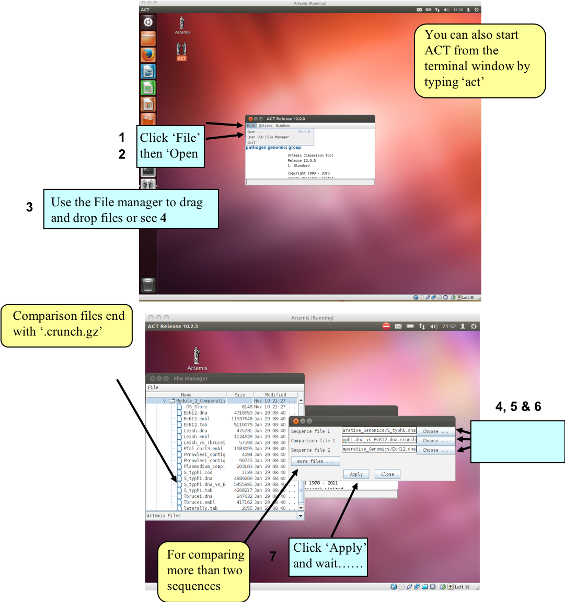  

***The basics of ACT***  
You should now have a window like this so let’s see what is there.

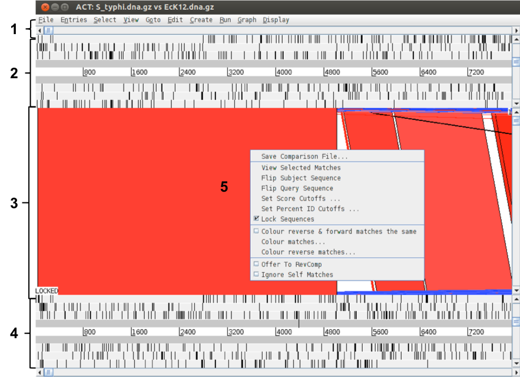  

**Key**  
1. Drop-down menus. These are mostly the same as in Artemis. The major difference you’ll find is that after clicking on a menu header you will then need to select a DNA sequence before going to the full drop-down menu.
2. This is the Sequence view panel for ‘Sequence file 1’ (Subject Sequence) you selected earlier. It’s a slightly compressed version of the Artemis main view panel. The panel retains the sliders for scrolling along the genome and for zooming in and out.
3. The Comparison View. This panel displays the regions of similarity between two sequences. Red blocks link similar regions of DNA with the intensity of red colour directly proportional to the level of similarity. Double clicking on a red block will centralise it. Blue blocks link regions that are inverted with respect to each other.
4. Artemis-style Sequence View panel for ‘Sequence file 2’ (Query Sequence).
5. Right button click in the Comparison View panel brings up this important ACT-specific menu which we will use later.

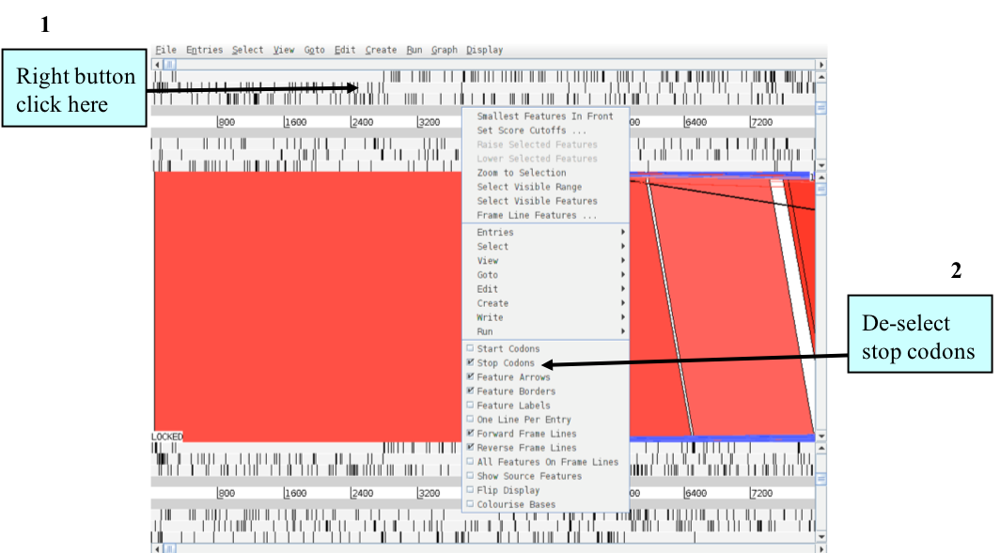  

[↥ **Back to top**](#top)
***
## Exercise 1 
In this first exercise we are going to explore the basic features of ACT. Using the ACT session you have just opened we firstly are going to zoom outwards until we can see the entire *S. Typhi* chromosome compared against the *E. coli* K12 chromosome. As for the Artemis exercises we should turn off the stop codons to clear the view and speed up the process of zooming out.

The only difference between ACT and Artemis when applying changes to the sequence views is that in ACT you must click the right mouse button over the specific sequence that you wish to change, as shown above.

Now turn the stop codons off in the other sequence too. Your ACT window should look something like the one below:

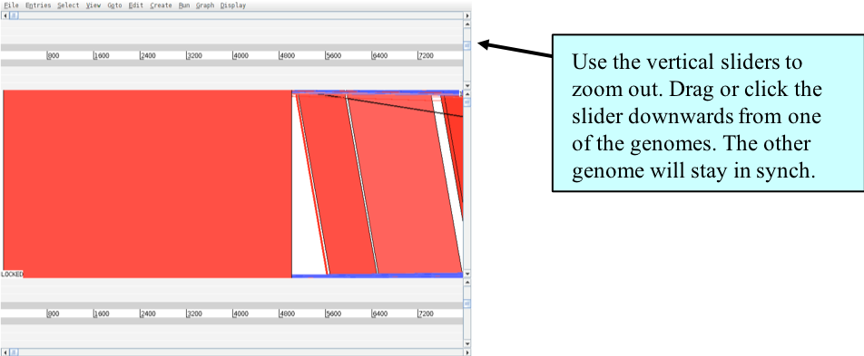  

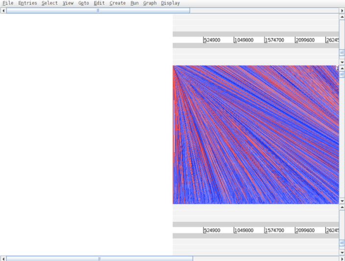  

Once zoomed out, your ACT window should look similar to the one shown above. If the genomes in view fall out of view to the right of the screen, use the horizontal sliders to scroll the image and bring the whole sequence into view, as shown below. You may have to play around with the level of zoom to get the whole genomes shown in the same screen as shown below.

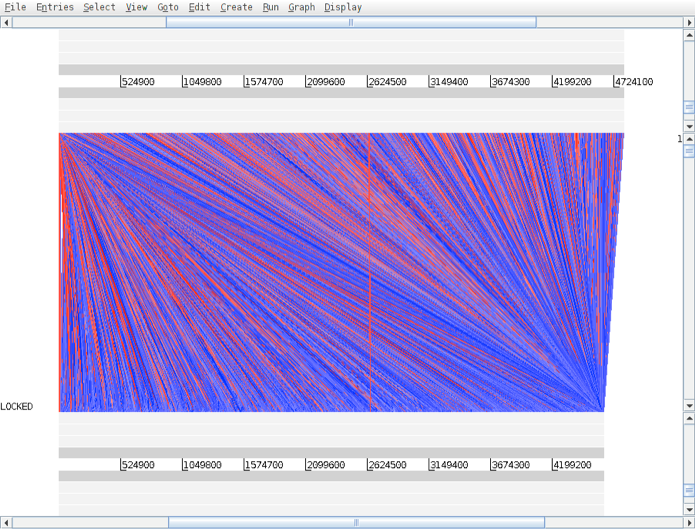  

Notice that when you scroll along with either slider both genomes move together. This is because they are ‘locked’ together. Right click over the middle comparison view panel. A small menu will appear, select Unlock sequences and then scroll one of the horizontal sliders. Notice that ‘LOCKED’ has disappeared from the comparison view panel and the genomes will now move independently

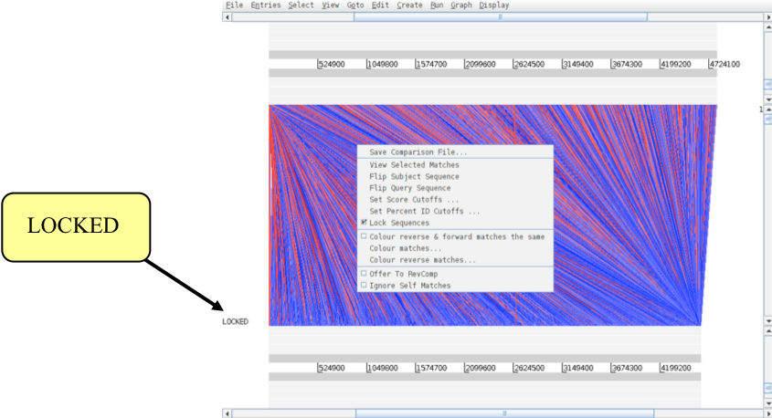  

You can optimise your image by either removing ‘low scoring’ (or percentage ID) hits from view, as shown below 1-3 or by using the slider on the the comparison view panel (4). The slider allows you to filter the regions of similarity based on the length of sequence over which the similarity occurs, sometimes described as the “footprint”.

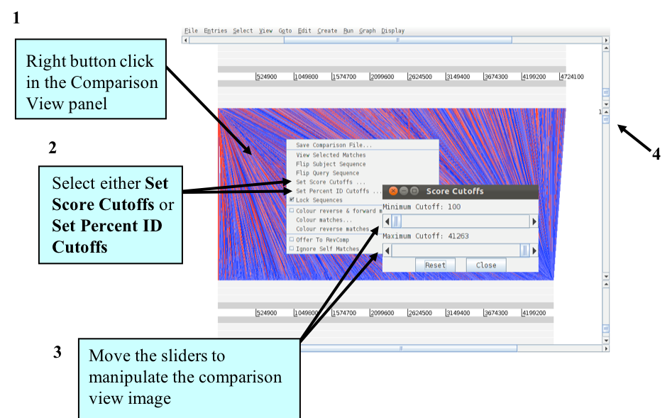  

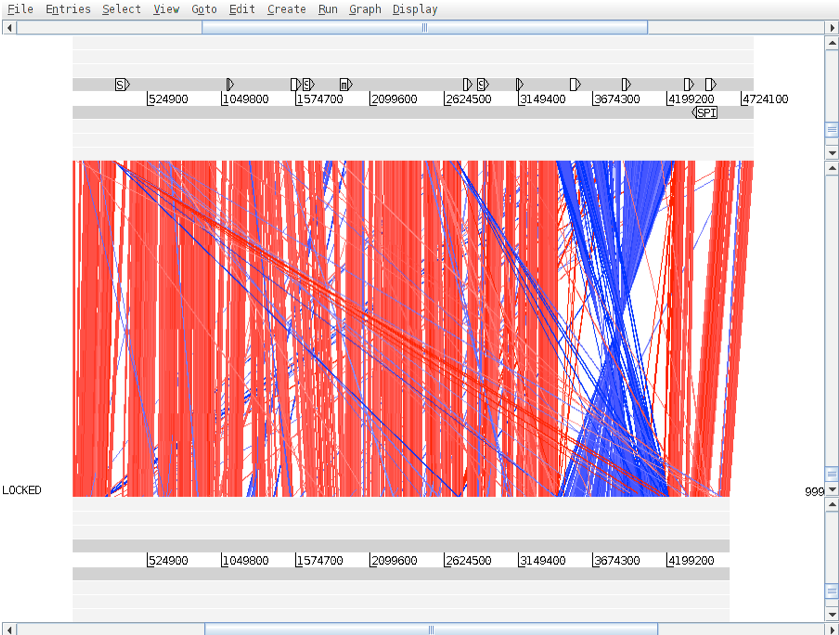  

***Things to try out in ACT***  
Load into the top sequence (*S. typhi*) a ‘.tab’ file called ‘laterally.tab.gz’. You will need to use the ‘File’ menu and select the correct genome sequence (‘S.typhi.dna.gz’) before you can read in an entry. If you are zoomed out and looking at the whole of both genomes you should see the above. The small white boxes are the regions of atypical DNA covering regions that we looked at in the first Artemis exercise. It is apparent that there is a backbone sequence shared with *E. coli* K12, plus chunks of *S. Typhi* specific DNA, which appear to be insertions relative to *E. coli* K12.   

***More things to try out in ACT***  
1. Double click red boxes to centralise them.
2. Zoom right in to view the base pairs and amino acids of each sequence.
3. Load annotation files into the sequence view panels.
4. Use some of the other Artemis features e.g., graphs etc.
5. Find an inversion in one genome relative to the other then flip one of the sequences.

Once you have finished this exercise remember to close this ACT session down completely before starting the next exercise

[↥ **Back to top**](#top)

***
## Exercise 2 
***P. falciparum and P. knowlesi: Genome Comparison***  
The annotation and analysis of the whole genome of *P. falciparum* 3D7 has been completed and genome sequences of several other malaria parasites are also available. This allows us to perform comparative analysis of the genomes of malaria parasites and understand the basic biology of their parasitism, based on the similarities / dissimilarities between the parasites at DNA / protein level.

You will be looking at the comparison between a genomic DNA fragment of the primate malaria *P. knowlesi* and the previously annotated chromosome 13 of *P. falciparum*. By comparing the two genomic sequences you will be able to study the degree of conservation of gene order (i.e., synteny) and identify genes in *P. knowlesi* genome. As part of the exercise you will also identify an unique region between the two genomic fragments and finally modify the gene model of a multi-exon gene in *P. knowlesi*, using ACT.

The files that you are going to need are:
- Pfal_chr13.embl.gz - P. falciparum annotation file with sequence
- Pknowlesi_contig.seq.gz - P. knowlesi DNA file (without annotation)
- Pknowlesi_contig.embl.gz - P. knowlesi annotation file
- Plasmodium_comp.crunch.gz - TBLASTX comparison file

  

Comparison of *P. knowlesi* contig and the annotated chromosome 13 fragment of *P. falciparum*.

***Conservation of gene order (synteny)***  
- In the ACT start up window load up the files Pfal_chr13.embl.gz, Pknowlesi_contig.seq.gz and the comparison file Plasmodium_comp.crunch.gz. Add the annotation file ‘Pknowlesi_contig.embl.gz’ to the Pknowlesi_contig.seq.gz sequence.
- Use the slider on either sequence view panel to obtain a global view of the sequence comparison. Also use the slider on the comparison view panel to remove the ‘shorter’ similarity hits.
     - What effects does this have?
- Can you see conserved gene order between the two species?
- Can you see any region where similarity is broken up?
     - Zoom in and look at some of the genes encoded within this unique region in file: Pfal_chr13.embl.gz (top sequence)
          - Example location: Pfal_chr13.embl.gz, 815823..829969
- What are the predicted products of the genes assigned to this unique location?
     - View the details by clicking on the feature, and then select 'Selected Features in Editor’ from the ‘Edit’ menu after selecting the appropriate CDS feature.
- Can you identify genes in conserved regions that have not been annotated in the *P. knowlesi* contig, but are present in the *P. falciparum* chromosome 13? This will allow you to see any potential protein coding regions.
- Any thoughts about the possible biological relevance of the comparison?

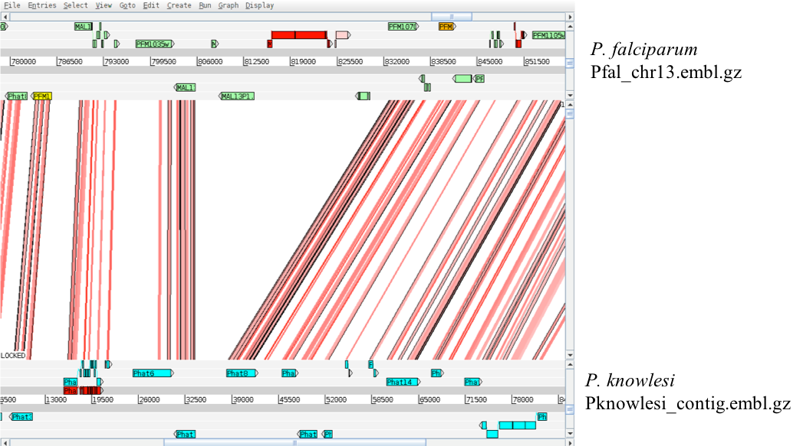  

***Prediction of gene models***   
There are several computer algorithms, covered earlier in the course, that predict gene models, based on training the algorithm with previously known gene sets with previously known experimentally verified exon-intron structures (in eukaryotes). However, no single programme can predict the gene structure with 100% accuracy and one needs to curate / refine the gene models, generated by automated predictions. We have generated automated gene models for the *P. knowlesi* contig, using PHAT (Pretty Handy Annotation Tool, a gene finding algorithm, see in Mol. Biochem. Parasitol. 2001 Dec;118(2):167-74) and the automated annotations are saved in Pknowlesi_contig.embl.gz.  

- Zoom into the *P. falciparum* gene labelled PFM1010w shown below. Can you compare the 2 gene models and identify the conserved exon(s) between the 2 species?  
- Use the slider on the comparison view panel to include some ‘shorter’ similarity hits. Can you now identify all the conserved exons of the PFM1010w orthologue in the P. knowlesi contig? (For the time being, disregard the misc_feature for ‘Phat4’, coloured in red in the ‘Pknowlesi_contig.embl.gz’ file )
- Open the ‘GC Content ( %)’ window from ‘graph’ menu for both the entries.
     - Can you relate the exon-intron boundaries to GC-content for the *P. falciparum* gene labelled PFM1010w? Is it also applicable to the gene model ‘Phat4’ in the *P. knowlesi* contig?
     - Example regions:
          - Pfal_chr13.embl.gz, 789034..793351
          - Pknowlesi_contig.embl.gz, 15618..20618

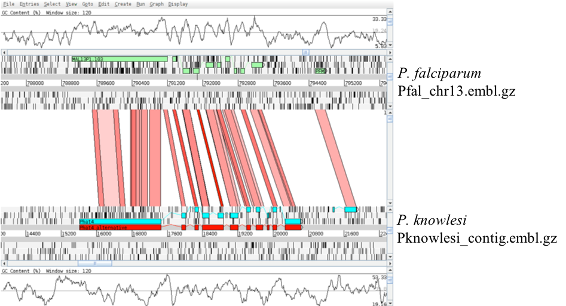  

***Gene models for multi-exon genes in P. falciparum (OPTIONAL)***
- Use ‘File’ menu to select entry ‘Pfal_chr13.embl.gz’ and select ‘Edit In Artemis’ to bring up an Artemis window.
- In Artemis window, use ‘Graph’ menu and switch ‘on’ the ‘GC Content (%)’ window.
- Use ‘Goto’ menu to select ‘Navigator’ window and within the Navigator window, select ‘Goto Feature With This Qualifier Value’ and type ‘PFM1010w’, click then close the dialogue box.
- Go through the annotated gene model for ‘PFM1010w’ and have a look at the the exon-intron boundaries and compare with the splice site sequences from *P. falciparum* given in Appendix VIIII.
- Also have a glance through a few other gene models for multi-exon genes and have a look at the intron sequences as well. Can you find any common pattern in the putative intron sequences?
     - Hint – look at the complexity of the sequence
- You can delete exon(s) of any gene by selecting the exon(s) and then choosing ‘Delete Selected Exons’ from ‘Edit’ menu. Similarly, you can add an exon to a particular gene by co-selecting the exon and the gene (CDS features) followed by selecting ‘Merge Selected Features’ from the ‘Edit’ menu.
     - Example regions:
          - Pfal_chr13.embl.gz, 789034..793351, 657638..660023, 672361..673753

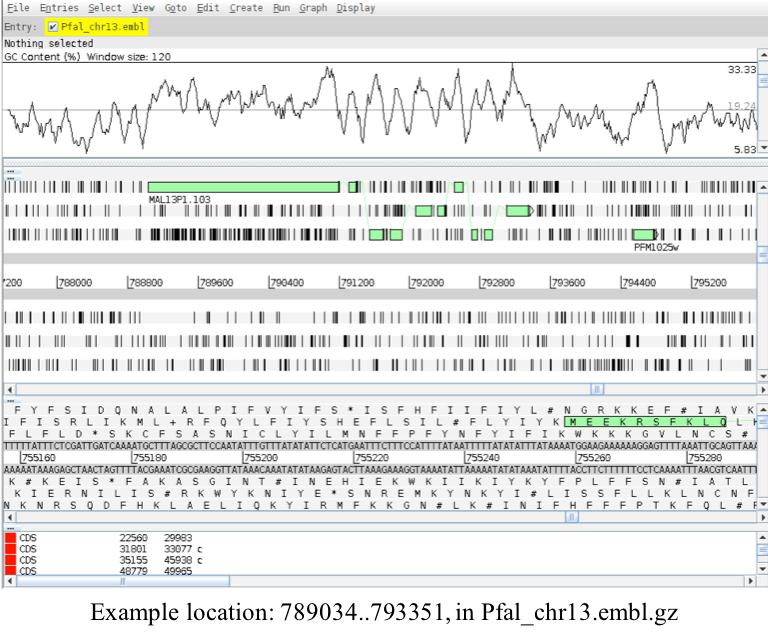  

***Curation of gene models in P. knowlesi (OPTIONAL)***  
We are now going to edit the gene model for *P. knowlesi*.
- Use ‘File’ menu from the ACT displaying *P. falciparum* and *P. knowlesi* to select entry ‘Pknowlesi_contig.embl.gz’ and select ‘Edit In Artemis’ to bring up an Artemis window.
- Within the Artemis window, use ‘Graph’ menu and switch ‘on’ the ‘GC Content (%)’ window.
- Use ‘Goto’ menu to select ‘Navigator’ window and within the Navigator window, select ‘Goto Feature With This Qualifier Value’ and type ‘Phat4’.
- Go to the first ACT window (first small window that appears when starting up ACT), and use the ‘Options’ menu to select ‘Enable Direct Editing’
- Go through the gene model of ‘Phat4’ and have a glance through the exon-intron boundaries. Can you suggest any alternative gene model, after consulting the Table provided in Appendix XI, containing several examples of experimentally verified splice site sequences for *P. falciparum*?
- Example modifications:
     - Have a look at the ‘misc_feature’, coloured in red (location: 15618..20618). Can you spot any difference in the red gene model of ‘Phat4’ at the exon-intron boundaries?
- Select the red feature, click on ‘Edit’ menu and select ‘Selected Features in Editor’ and in the new window that pops out, change the ‘Key’ from misc_feature to ‘CDS’ and click on ‘OK’ button to close the window. Now you can compare the automatically created blue gene model and the curated red gene models at protein level and predict any alternative splicing pattern.

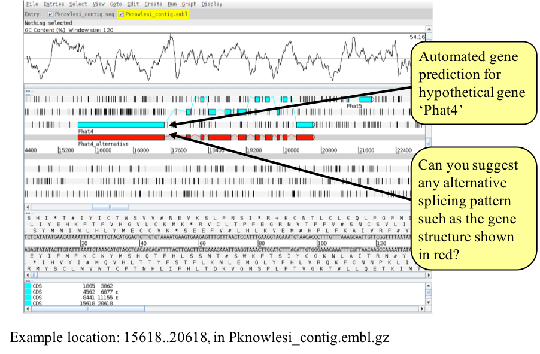  

[↥ **Back to top**](#top)
***
## Exercise 3 
Having familiarised yourselves with the basics of ACT, we are now going to use it to look at a region of synteny between *T. brucei* and *Leishmania major*.  

By looking at a comparison of the annotated sequences of *T. brucei* and *L. major* you will be able to analyse, in detail, those genes that are found in both organisms as well as spot the differences. You will also see how ACT can be used to study the different chromosome architecture of these two parasite species.

The files that you are going to need are:
- Tbrucei.dna.gz - *T. brucei* sequence
- Tbrucei.embl.gz - *T. brucei* annotation 			
- Leish_vs_Tbrucei.tblastx.gz	- comparison file
- Leish.dna.gz	- *L. major* sequence
- Leish.embl.gz - *L. major* annotation

First, load up the sequence files for T. brucei and L. major and the comparison file in ACT.

Next, you need to find the regions of synteny between the sequences.

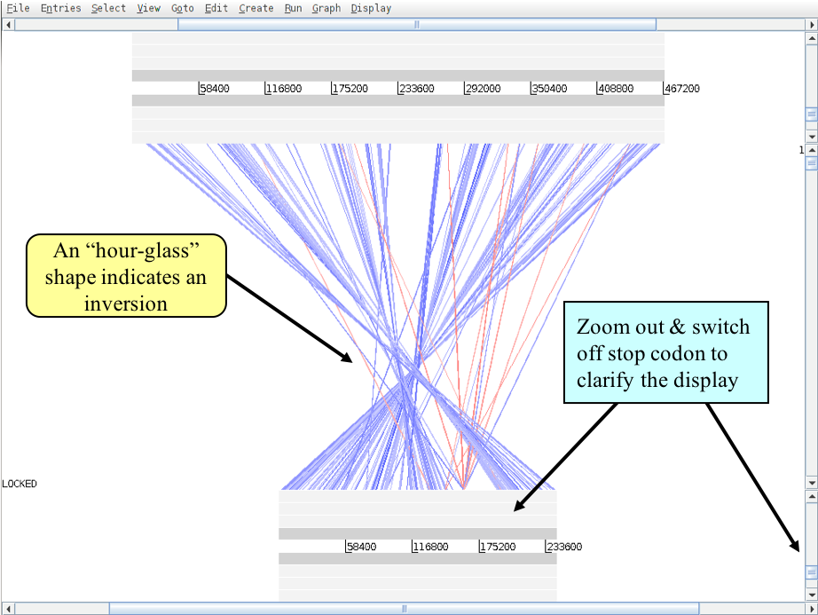

When you have determined where there is synteny, zoom in to the region for a detailed look. At this point you can add the annotation from the files called Leish.embl.gz and Tbrucei.embl.gz.

**Questions**
- Can you see conserved gene order between the two species?
- Can you see any region where similarity is broken up?
     - Zoom in and look at some of the genes encoded within these regions.
- What are the predicted products of the genes assigned to these locations?
     - View the details by clicking on the feature, and then select 'Edit selected feature’ from the ‘Edit’ menu after selecting the appropriate CDS feature.
- Can you identify any genes in one organism that have hits to, or are similar to, regions in the other organism but which don’t appear to be predicted?
     - If so, add these to your annotation.

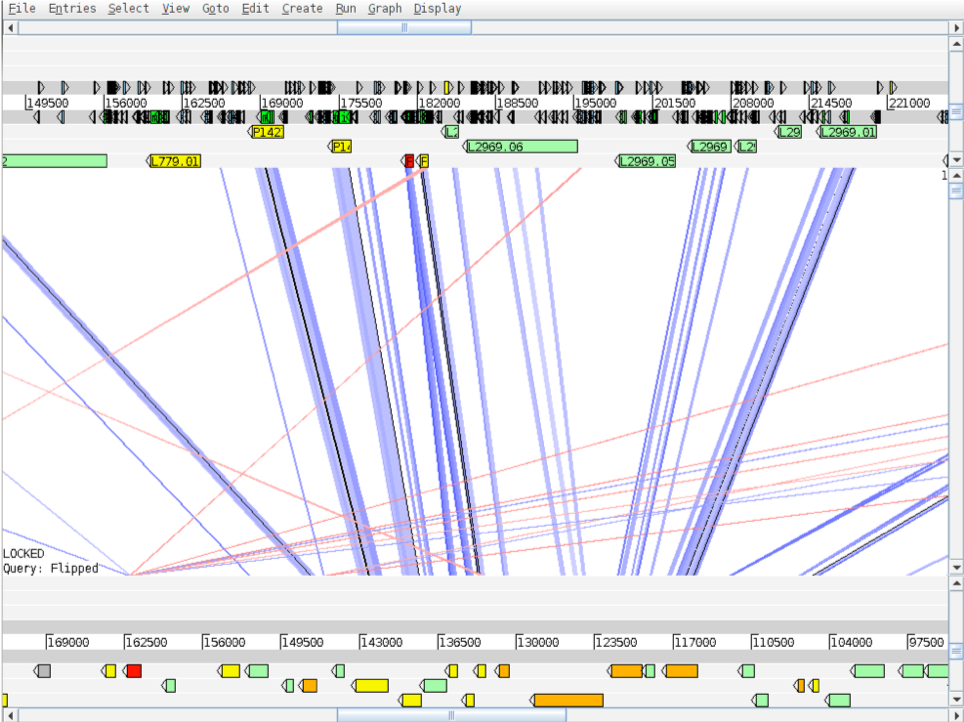

[↥ **Back to top**](#top)
******
## License
 This work is licensed under a <a rel="license" href="http://creativecommons.org/licenses/by/4.0/">Creative Commons Attribution 4.0 International License</a>.
